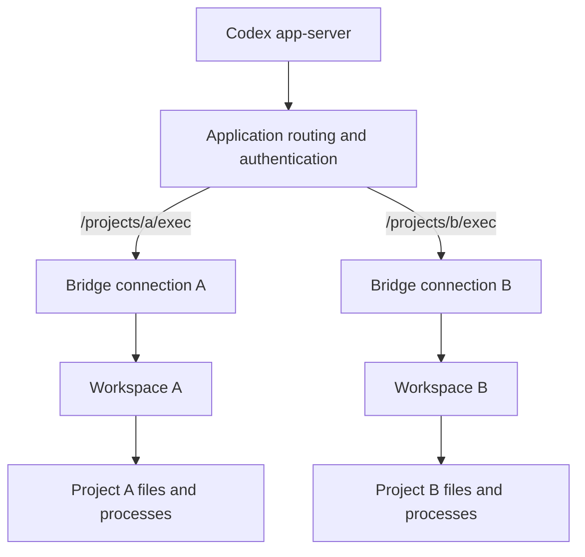

**Design example, not a shipped API.** The bridge function, endpoint type, and application helpers below are illustrative. The current package does not export them. This page preserves the intended integration for implementation and future runnable documentation.

## One service, many projects

An application hosts a WebSocket server. Each project route selects an authorized Workspace. An ohkit bridge handles the executor protocol on each accepted connection. The application does not parse native file/process requests or construct process-output notifications.



A project endpoint is a logical route, not a dedicated server process. The control client and executor service can be deployed separately.

## Bridge boundary

The proposed entry point consumes complete protocol text messages and sends responses and asynchronous notifications. It does not create a listener or depend on a particular Web framework.

```python
# Conceptual signature; Workspace and this function are not shipped yet.
from collections.abc import AsyncIterable, Awaitable, Callable


async def serve_codex_executor(
    workspace: Workspace,
    *,
    messages: AsyncIterable[str],
    send: Callable[[str], Awaitable[None]],
) -> None:
    ...
```

Each invocation owns its protocol state and the file/process handles it creates. The bridge coordinates replies and asynchronous output; a request-to-response function alone is insufficient.

## Application route

This ASGI-style sketch uses application-owned authentication, authorization, and Workspace acquisition. `app`, `WebSocket`, and the helper functions stand for the application's framework and services, not ohkit exports.

```python
# Conceptual application code, not an executable tutorial.
@app.websocket("/projects/{project_id}/exec")
async def project_executor(
    websocket: WebSocket,
    project_id: str,
) -> None:
    principal = await authenticate(websocket)
    await authorize_project(principal, project_id)

    async with acquire_workspace(project_id) as workspace:
        await websocket.accept()
        await serve_codex_executor(
            workspace,
            messages=websocket.iter_text(),
            send=websocket.send_text,
        )
```

The transport adapter reports disconnection through iterator completion or an exception. The bridge settles its owned resources before the Workspace acquisition context exits. The application handles WebSocket closure and rejection behavior for its framework.

`acquire_workspace()` may borrow a long-lived provider or acquire one for this binding. A closing connection must not destroy a shared project provider or another connection's processes.

## Control-side endpoint

The controller only needs the executor address and connection credentials. It need not have the execution service's Python Workspace object.

```python
# Conceptual configuration; project_token comes from application secret storage.
executor = CodexExecutorEndpoint(
    url="wss://executor.example.com/projects/a/exec",
    bearer_token=project_token,
)
```

The Codex backend registers the supplied endpoint and selects it for the native conversation. The application supplies an address reachable from app-server, which may differ from the listener's bind address. TLS, proxies, tunnels, and project authorization belong to the application deployment.

## Resource and authority boundaries

- Each connection has independent protocol state and owned handles, even when it borrows the same Workspace as another connection.
- Connection closure cleans up that connection's resources. The initial bridge does not promise retained handles or native executor-session resumption across disconnection.
- An unknown write or process-launch outcome is not automatically replayed.
- A project URL or default cwd does not isolate a process. The provider enforces file and process authority, including access outside the project's folder.
- A local convenience listener can use this same bridge. Remote hosting does not require a second implementation.

See the [Codex backend contract](https://github.com/Wh1isper/ohkit/blob/main/spec/backends/01-codex.md) and [Workspace lifetime](https://github.com/Wh1isper/ohkit/blob/main/spec/workspace/00-overview.md#binding-and-lifetime) for the owning specifications.
