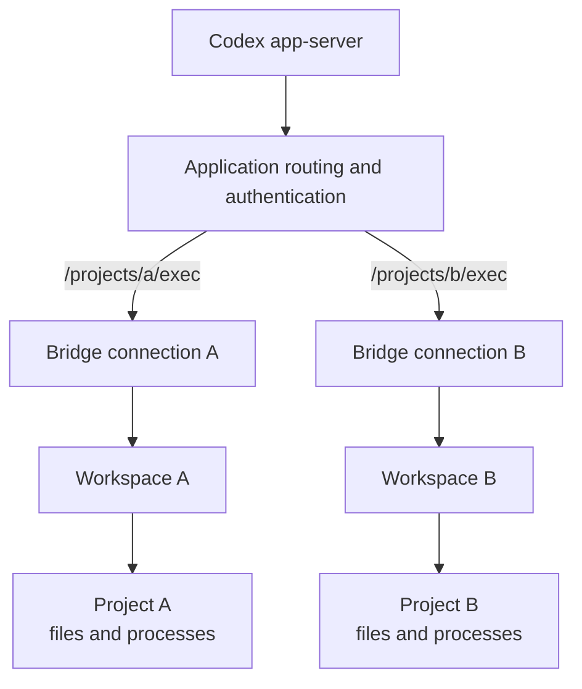

## Run the example

The checkout includes [`examples/hosted_workspace.py`](https://github.com/Wh1isper/ohkit/blob/main/examples/hosted_workspace.py), an executable authenticated loopback host. Install the checkout and configure native Codex first, then run:

```bash
uv run python -m examples.hosted_workspace /trusted/project \
  --prompt "Read AGENTS.md if present, then summarize the project."
```

This invokes your configured native model provider and may incur provider charges. The example chooses an ephemeral loopback port and token, requires the bearer token before accepting the WebSocket, and supplies the token to `CodexExecutor`. It closes native control before closing the application-owned server. It deliberately uses `danger-full-access` and `approval_policy="never"`: **only run it with trusted prompts and peers.** The reference provider has full host-account authority; a project folder is not a sandbox.

## One service, many projects

An application hosts a WebSocket server. Each exact project route selects a Workspace and its authorization credential. ohkit handles native file/process requests, responses, and output notifications; it does not own the listener or a project registry.



The example's `ExecutorHost` can host more than one route:

```python
from examples.hosted_workspace import ExecutorHost
from websockets.asyncio.server import serve

# Application-supplied Workspace objects and secrets, not ohkit registrations.
host = ExecutorHost(
    {
        "/projects/a/exec": (token_a, workspace_a),
        "/projects/b/exec": (token_b, workspace_b),
    }
)
async with serve(host.handle, "127.0.0.1", 4501, process_request=host.authorize):
    await application_shutdown.wait()
```

`examples` is checkout code, not an installed ohkit module. Adapt authentication to your application. Distinct routes are not tenant isolation: providers enforce actual file/process authority and coordination of concurrent writes. Deploy TLS and network controls for connections beyond trusted loopback.

## Framework-independent bridge

Only complete text messages and an async send callback cross the bridge boundary:

```python
from ohkit.backends.codex import CodexExecBridge

# After application authentication and project authorization:
bridge = CodexExecBridge(workspace)
await bridge.serve(websocket.iter_text(), websocket.send_text)
```

Here `websocket` is the application's framework object. The executable example uses `websockets` instead, validates text frames, and translates its iterator/connection methods. Disconnection must end or raise from the incoming iterator. `serve` settles connection-owned resources before returning or raising; the host must not dispose of the borrowed provider earlier. Surface cleanup failures rather than catching every exception as normal disconnection.

The control client needs only `CodexExecutor(url, bearer_token=...)` and the target cwd; it need not share Python memory with the Workspace host. The advertised URL must be reachable from app-server and may differ from the listener bind address. Your application owns proxy/tunnel arrangements.

## Supported lifetime

Each connection has independent protocol state and handles. Shared Workspaces and listeners remain application-owned. A Run ending does not imply all executor handles have closed, and closing a control WebSocket does not stop a borrowed app-server or its registered executor. Keep hosting alive for the native execution lifetime.

External execution currently supports new Threads and subsequent Runs on those live Threads, not external history resume/fork or executor-session recovery. Use a dedicated app-server rather than mixing external registration with default-environment consumers. See [Workspace binding and limits](../workspace.md#codex-binding) for the exact restriction, provider contract, and unsandboxed authority boundary.
