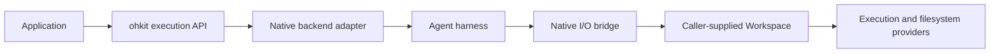

# ohkit Specifications

## Definition

ohkit is an independent Python programming interface for agent harnesses. Applications use it to start work, observe progress, interact with a running agent, and continue native conversation history without owning each harness's transport protocol.

Native harnesses own their agent loops, model calls, tools, Turns, and history formats. ohkit owns the common execution boundary and native adapters. Applications own policy, durable scheduling, persistence, and delivery. Agent Foundation and a13n are downstream integrations, not dependencies.

## Architecture

The lower I/O path is optional and backend-dependent. Workspace does not replace the native agent loop or promise interception of every native operation.

## Reading Path

Read the architecture first, then the contracts relevant to the integration:

1. [Execution overview](execution/00-overview.md): components, ownership, and end-to-end flow.
2. [Thread and Run](execution/01-thread-run.md): logical work, steering, completion, and continuation.
3. [Observation and interaction](execution/02-observation-interaction.md): events, results, approvals, and questions.
4. [Workspace overview](workspace/00-overview.md): dependency inversion, routing, and resource lifetime.
5. [Backend overview](backends/00-overview.md): native mappings and compatibility boundaries.

## Contract Catalog

| Area                                          | Owner                                   |
| --------------------------------------------- | --------------------------------------- |
| Execution and lifecycle                       | [Execution](execution/README.md)        |
| Supplied file and process operations          | [Workspace](workspace/README.md)        |
| Codex, ACP, and Claude mappings               | [Backends](backends/README.md)          |
| Shared values and terminology                 | [Data conventions](data-conventions.md) |
| Python API and compatibility                  | [API conventions](api-conventions.md)   |
| Repository, packaging, and release boundaries | [Repository model](repository-model.md) |

## Specification and Implementation

These documents define the accepted contracts, including integration boundaries not yet implemented. The package implements the shared execution API, typed Workspace operations, Codex app-server control, and an application-hosted Codex file/process executor for explicitly unsandboxed new Threads. ACP and Claude remain design targets. A specification alone is not a backend-support claim. User documentation and compatibility tests identify available imports and verified native behavior; conceptual examples here are not exhaustive signature listings.

On the default branch, `spec/` records accepted design. Changes on a pull-request branch remain subject to review. Detailed API signatures and native compatibility tests accompany implementation; they must preserve these ownership and lifecycle boundaries.
