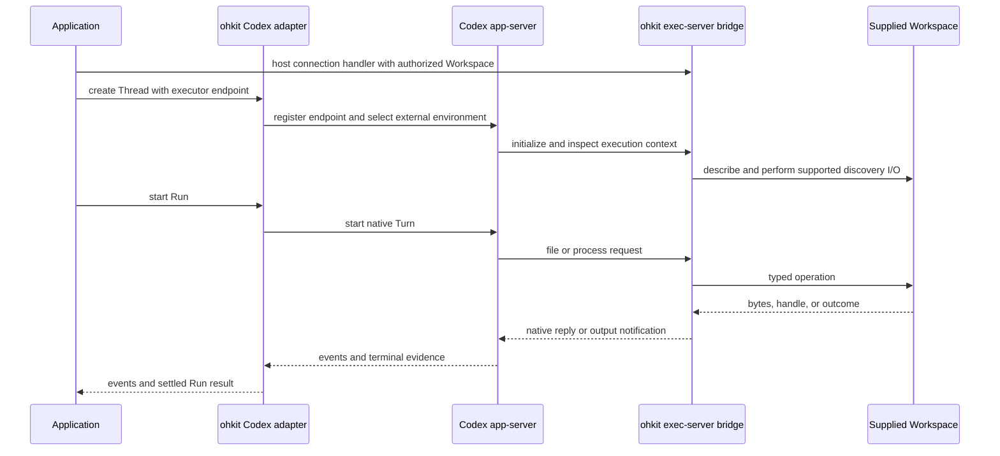

# Codex Backend

## Design Position

The Codex integration has two independent parts: a control backend connected to app-server, and an embeddable exec-server bridge connected to a Workspace. The application owns the WebSocket listener, authentication, routing, and deployment of that bridge. Control and execution can share a Python process or run in separate services; the control backend does not need the execution service's Workspace object.

The application supplies Workspace operations and transport I/O, not executor messages, native process IDs, or patch parsing. The bridge consumes complete protocol text messages and sends responses and asynchronous notifications through application-supplied I/O. It owns protocol ordering and request/resource correlation without requiring a particular Web framework. In a13n, Workspace delegates to Environment providers.

## Hosting and Connection Ownership

The control backend supports owned stdio app-server processes and connections to caller-owned remote app-server services. Closing an owned backend releases its own connections and processes; it does not stop a borrowed remote service or an application-hosted executor listener. Control transport selection is independent of Workspace location. Stdio control does not imply a stdio executor bridge.

An external executor endpoint identifies the address reachable by app-server and the credentials needed to connect. It does not carry a Python Workspace or grant access by itself. The hosting application authenticates and authorizes the requested project before admitting the connection. The listener's bind address and app-server's reachable endpoint may differ through a proxy or tunnel; the application owns that network arrangement. Credentials are not conversation-history references or loggable endpoint metadata.

One application listener can expose many URL paths, each bound to an authorized Workspace. A path selects a binding; it is not a built-in ohkit project registry or filesystem router. Multiple connections to one path have separate protocol state and owned file/process handles. Provider lifetime, whether a Workspace may be shared, and coordination of concurrent writes remain application responsibilities.

Each bridge invocation serves one live executor connection. It handles handshake, replies, asynchronous process output, and native errors. Incoming-message completion, transport failure, or cancellation stops admission and settles in-flight operations and owned handles before the borrowed Workspace is released. Cleanup affects only resources created by that connection, never another connection or the entire project. Unresolved effects and cleanup failures remain explicit. The initial bridge does not retain live handles across disconnection or claim successful native session resumption; unsupported recovery requests are rejected. A new connection creates a fresh resource scope.

A local convenience host may compose the same bridge with a loopback listener. It is optional, not a second executor implementation or a requirement for the control backend.

## Conversation and Control

Native thread creation, resume, and fork map to their ohkit counterparts within Codex's history scope. A Run starts native work and follows Codex's terminal evidence. Native follow-up activity is included only where it belongs to admitted foreground work.

Active steering uses `turn/steer` with the expected current native Turn ID. Rejection because the Turn ended does not fall back to `turn/start`. Interruption requests use the native active-work cancellation path and await termination evidence; the request response alone is not cancellation completion.

Native approval and question requests go through the [interaction contract](../execution/02-observation-interaction.md#live-decisions). Native IDs stay in the adapter, which prevents stale replies from affecting later work.

## Workspace Binding

The control adapter registers the supplied executor endpoint with `environment/add` and selects that environment for the native conversation. Registration acceptance is not execution readiness. Connection preparation and usable tool availability must be established from native state; no fixed sleep is a compatibility strategy.

Native app-server path strings and executor file URIs are different representations. The adapter preserves the selected Workspace's namespace and converts representation only. Native response fields describing the app-server host must not overwrite the supplied target cwd or be treated as executor metadata.

Codex remains responsible for parsing and applying its patch language; the selected filesystem performs the underlying reads and writes. Native process requests carry argv, environment policy, stdin/TTY requirements, and execution restrictions. The bridge projects [Workspace files and processes](../workspace/01-files-processes.md) into native responses, output notifications, and retained reads.

The adapter preserves independent process exit and output closure. If native tool result collection treats exit as output completion, the bridge publishes terminal process evidence only after draining the output it promises to deliver. Sequence numbers and retention remain native-adapter details, not public Workspace IDs.

## Supported-Mode Boundary

The initial integration targets the file/process executor path. Optional capability discovery, environment-config access, HTTP forwarding, shell snapshots, writable streams, and managed networking are not implicitly supplied by Workspace. The adapter advertises only implemented features and admits only modes whose required paths it can serve.

Required startup I/O is part of compatibility, not just model-visible tool calls. File metadata, instruction discovery, missing-file errors, canonicalization, and stream semantics cannot be substituted with plausible dummy results in a production adapter.

Sandbox requirements must be enforced or rejected. Selecting an explicit unsandboxed mode does not prove sandbox support. The bridge is an authority-bearing endpoint. Its application host admits only authorized native peers through a protected transport. A project URL or default cwd is not filesystem or process isolation; the Workspace provider enforces the actual authority. The bridge is not an unauthenticated public execution service.

Workspace does not relocate all Codex state. Native history, credentials, app-server configuration, and unbridged native paths remain under their own owners. The [common binding lifetime](../workspace/00-overview.md#binding-and-lifetime) governs borrowed providers and owned handles.

## Control Protocol Compatibility

The implemented control adapter derives private typed wire models from a pinned official app-server schema export. Upstream owns fields and aliases; the adapter owns method/response association and semantic projection into shared values. Generated native types are not public ohkit API. Required fields, nullable values, and omission remain distinct. Known field types are validated without coercion; additive native fields are preserved. Invalid known shapes fail explicitly, and possible dispatch without usable acknowledgement retains unknown-outcome semantics.

A schema-compatible message is not proof of execution completion, steering consumption, or an authorized decision. Those guarantees remain governed by execution and interaction contracts. Reproducible generation, controlled protocol tests, and exact-version native tests provide separate evidence. Automated upstream version/schema comparison reports drift for review; it does not expand the tested range or upgrade the baseline automatically. [Protocol maintenance](../../docs/codex-protocol.md) owns the contributor procedure.

## Upstream Basis

The mapping is grounded in Codex `rust-v0.161.0` and remains version-sensitive:

- [App-server environment selection](https://github.com/openai/codex/blob/rust-v0.161.0/codex-rs/app-server-protocol/src/protocol/v2/environment.rs).
- [Executor protocol](https://github.com/openai/codex/blob/rust-v0.161.0/codex-rs/exec-server-protocol/src/protocol.rs), including `process/start`, output/exit/close, file operations, metadata, and capability advertisement.
- [Selected-environment integration tests](https://github.com/openai/codex/blob/rust-v0.161.0/codex-rs/app-server/tests/suite/v2/selected_environment.rs).

This source baseline is not a declaration of a shipped ohkit compatibility range. Production admission and the tested range belong to the implemented adapter.
