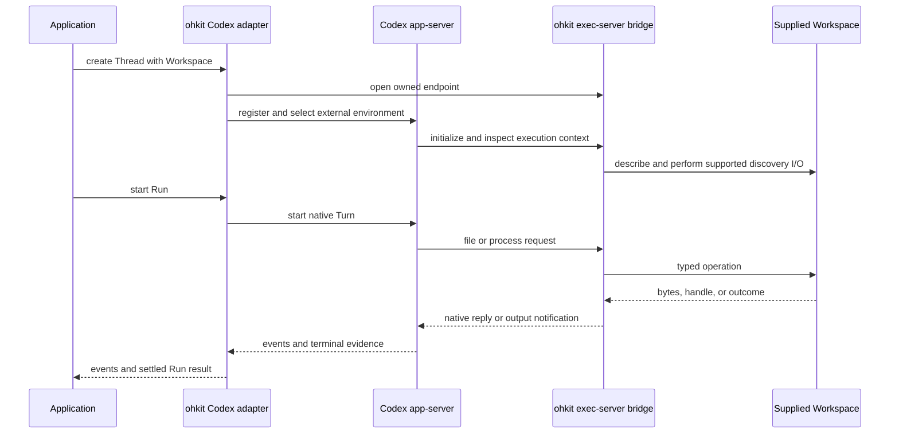

# Codex Backend

## Design Position

The Codex backend controls native Codex through app-server. When supplied a Workspace, the backend also implements the external exec-server endpoint consumed by app-server. These are two directions of one integration, not two competing agent loops.

The application implements Workspace, not WebSocket messages, Codex process IDs, or patch parsing. In a13n, that implementation delegates to its Environment providers.

## Conversation and Control

Native thread creation, resume, and fork map to their ohkit counterparts within Codex's history scope. A Run starts native work and follows Codex's terminal evidence. Native follow-up activity is included only where it belongs to admitted foreground work.

Active steering uses `turn/steer` with the expected current native Turn ID. Rejection because the Turn ended does not fall back to `turn/start`. Interruption requests use the native active-work cancellation path and await termination evidence; the request response alone is not cancellation completion.

Native approval and question requests go through the [interaction contract](../execution/02-observation-interaction.md#live-decisions). Native IDs stay in the adapter, which prevents stale replies from affecting later work.

## Workspace Binding

The adapter registers its endpoint with `environment/add` and selects that environment for the native conversation. Registration acceptance is not execution readiness. Connection preparation and usable tool availability must be established from native state; no fixed sleep is a compatibility strategy.

Native app-server path strings and executor file URIs are different representations. The adapter preserves the selected Workspace's namespace and converts representation only. Native response fields describing the app-server host must not overwrite the supplied target cwd or be treated as executor metadata.

Codex remains responsible for parsing and applying its patch language; the selected filesystem performs the underlying reads and writes. Native process requests carry argv, environment policy, stdin/TTY requirements, and execution restrictions. The bridge projects [Workspace files and processes](../workspace/01-files-processes.md) into native responses, output notifications, and retained reads.

The adapter preserves independent process exit and output closure. If native tool result collection treats exit as output completion, the bridge publishes terminal process evidence only after draining the output it promises to deliver. Sequence numbers and retention remain native-adapter details, not public Workspace IDs.

## Supported-Mode Boundary

The initial integration targets the file/process executor path. Optional capability discovery, environment-config access, HTTP forwarding, shell snapshots, writable streams, and managed networking are not implicitly supplied by Workspace. The adapter advertises only implemented features and admits only modes whose required paths it can serve.

Required startup I/O is part of compatibility, not just model-visible tool calls. File metadata, instruction discovery, missing-file errors, canonicalization, and stream semantics cannot be substituted with plausible dummy results in a production adapter.

Sandbox requirements must be enforced or rejected. Selecting an explicit unsandboxed mode does not prove sandbox support. The bridge is an authority-bearing endpoint and must be reachable only by its intended native peer through the configured protected transport. It is not an unauthenticated public execution service.

Workspace does not relocate all Codex state. Native history, credentials, app-server configuration, and unbridged native paths remain under their own owners. The [common binding lifetime](../workspace/00-overview.md#binding-and-lifetime) governs borrowed providers and owned handles.

## Upstream Basis

The mapping is grounded in Codex `rust-v0.161.0` and remains version-sensitive:

- [App-server environment selection](https://github.com/openai/codex/blob/rust-v0.161.0/codex-rs/app-server-protocol/src/protocol/v2/environment.rs).
- [Executor protocol](https://github.com/openai/codex/blob/rust-v0.161.0/codex-rs/exec-server-protocol/src/protocol.rs), including `process/start`, output/exit/close, file operations, metadata, and capability advertisement.
- [Selected-environment integration tests](https://github.com/openai/codex/blob/rust-v0.161.0/codex-rs/app-server/tests/suite/v2/selected_environment.rs).

This source baseline is not a declaration of a shipped ohkit compatibility range. Production admission and the tested range belong to the implemented adapter.
