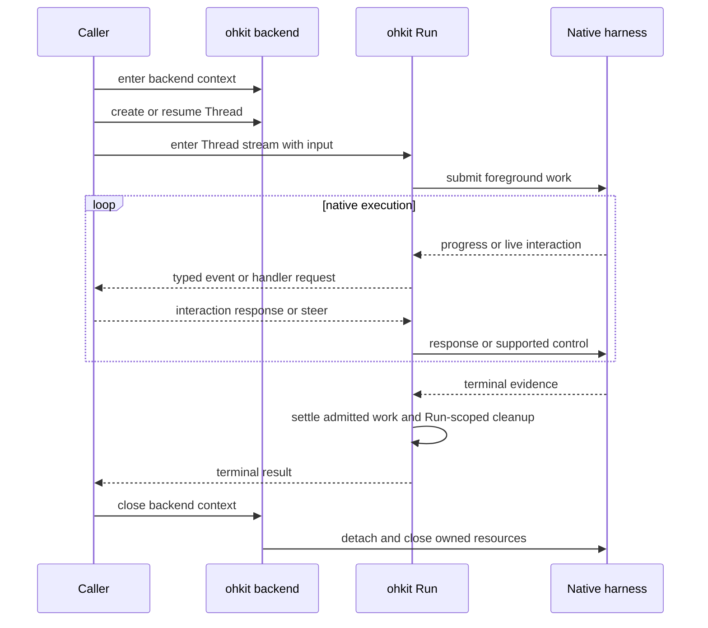

# Execution Architecture

## Design Position

ohkit is a thin, typed execution library, not another agent framework. It provides a consistent way to execute, observe, control, and continue native agent harnesses. It does not recreate their model catalogs, tool systems, prompt loops, or history stores.

The common surface is intentionally smaller than any complete native SDK. Backend-specific options stay with the backend that can interpret them; unavailable behavior is explicit rather than emulated with a different lifecycle.

## Major Components

| Component            | Responsibility                                                     | Boundary                                                             |
| -------------------- | ------------------------------------------------------------------ | -------------------------------------------------------------------- |
| Backend              | Connect to or launch a native harness and create or reopen Threads | Owns its connections and resources, not application persistence      |
| Thread               | Preserve native conversation and context continuity                | Not a worker, process, or durable scheduling record                  |
| Run                  | Represent one accepted unit of foreground logical work             | Not necessarily one native Turn                                      |
| Events and result    | Expose progress and the logical work's outcome                     | Not a durable event log or exactly-once delivery protocol            |
| Interaction handlers | Supply typed approval and question responses                       | Caller decides policy; adapter translates native requests            |
| Workspace bridge     | Delegate supported native file/process work                        | Optional; [Workspace](../workspace/00-overview.md) owns its contract |

Concrete backend objects are the normal entry points. Small structural interfaces serve real extension boundaries; a registry, configuration compiler, builder hierarchy, and universal workflow engine are not part of this model.

## Primary Flow



The backend remains responsible for native request routing while the caller handles events or decisions. Observing output is not the mechanism that grants permission to execute a tool.

## Python Interaction Shape

```python
# Conceptual usage; not an API available in the bootstrap package.
async with Codex(options=codex_options) as backend:
    thread = await backend.new_thread(workspace=workspace, cwd="/project")
    async with thread.stream("Inspect and fix the failing test.", handlers=handlers) as run:
        async for event in run:
            await observe(event)
        result = await run.result()

    follow_up = await thread.run("Explain the change.", handlers=handlers)
    reference = thread.ref
```

`stream` is an asynchronous context manager for one Run and one event consumer. `run` is the result-only convenience over the same driver, including interaction handling and event drainage. Neither entry point creates a second execution algorithm. [Thread and Run](01-thread-run.md) owns admission and exit behavior.

## Independent Completion Boundaries

| Boundary                            | What it establishes                                                                  | Authority             |
| ----------------------------------- | ------------------------------------------------------------------------------------ | --------------------- |
| Native request response             | A protocol request was accepted or rejected                                          | Native harness        |
| Native Turn completion              | A native unit of execution ended                                                     | Native harness        |
| Logical Run result                  | Admitted foreground work has a terminal outcome                                      | ohkit adapter and Run |
| Live binding close                  | Owned callbacks, connections, and handles are settled or cleanup failure is reported | ohkit                 |
| Durable commit or external delivery | Application state or recipient delivery is committed                                 | Caller                |

The same architecture supports an embedded application and a managed worker. Durable leases, retries after crashes, user access control, billing, and delivery stay outside ohkit.
