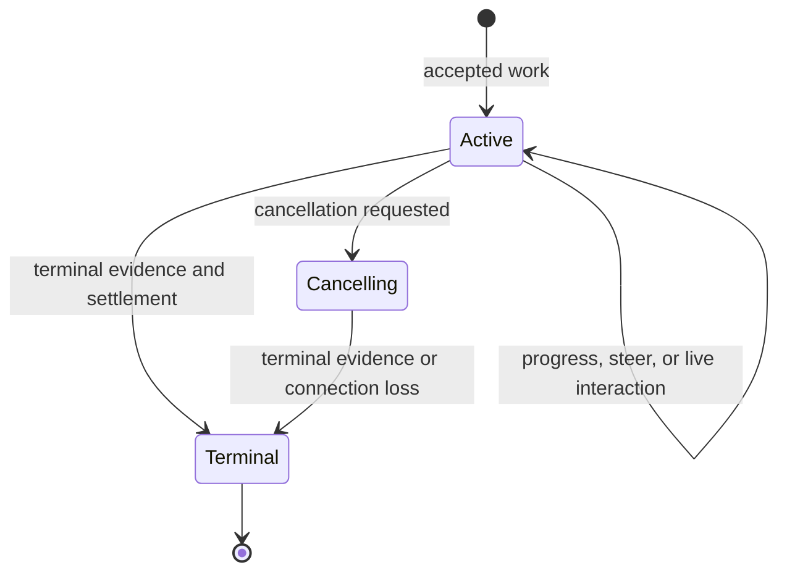

# Thread and Run

## Domain Model

A **Thread** is conversation and context continuity within a native backend. A live Thread object is an execution owner attached to that conversation. A **Run** is one accepted unit of foreground logical work on that owner. A **Turn** is a native harness execution boundary; the native harness, not ohkit, owns Turn scheduling.

One Run can span several native Turns. Tool calls, approval waits, and native follow-up Turns do not automatically create another Run. Native identifiers may be retained as observation metadata without becoming a public Turn scheduler.

## Admission and Control

A live Thread owner admits at most one active Run. Concurrent attempts fail explicitly; they are not silently queued. The caller coordinates multiple owners or processes attached to the same native conversation. ohkit does not establish a distributed lease.

Entering the stream context admits work; constructing it does not dispatch. Validation or known native rejection before admission yields an error without a successful Run. If submission may have reached the native harness but its acknowledgement is lost, report uncertainty rather than resubmit automatically.

`steer` targets a particular active Run. It adds input to that logical work without creating or scheduling the next Run. A native harness may buffer, coalesce, or perform another Turn inside the same Run. A successful steer acknowledgement means accepted input, not proof that the model has consumed or obeyed it.

The adapter coordinates steering admission with terminalization. If completion wins, steering is rejected as no longer active. If admission wins, the adapter accounts for that input before ending the Run: consumed work, known rejection/cancellation, or an explicitly uncertain outcome. It cannot report clean completion while admitted input silently becomes a future Run. Backends that cannot establish this boundary do not advertise steering.

## Run Lifecycle

Terminal outcomes distinguish completed, failed, cancelled, and unknown native outcome. A completed result means the native logical work ended normally; it is not proof that the user's goal was achieved. Transport loss after possible execution is not successful completion or confirmed cancellation.

A Run becomes terminal once. Its result remains stable. Late background events do not reopen it or cause a second result. They are not attributed to another Run merely because that Run is now active.

A terminal result requires either the backend's completion evidence or an explicit unknown-outcome classification, settlement of admitted control requests and live interactions, and Run-scoped cleanup. Uncertainty is recorded rather than converted into successful settlement. It does not require closing every conversation-scoped process. [Workspace lifetime](../workspace/00-overview.md#binding-and-lifetime) owns that distinction.

## Cancellation and Cleanup

Cancellation is a request to stop the active logical work, not observed exit. Repeated cancellation does not create another native task. Normal completion may win a race with cancellation; the result reflects the outcome actually established.

Leaving a stream early requests cancellation and settles or reports failure of Run cleanup. It does not silently detach foreground work. Native request routing stays alive long enough to process cancellation and cleanup callbacks. If termination cannot be established, the caller receives an unknown outcome or cleanup error, not a false cancelled result.

A lost connection or unresolved cleanup makes the affected execution owner unavailable for new Runs until it is explicitly re-established. Cleanup errors retain any already observed native result as evidence; they do not erase it or imply rollback. Closing a Thread stops new Run admission before awaiting cleanup. Concurrent and repeated close calls observe the same cleanup completion or failure; cancelling one waiter does not abandon the owned cleanup. Already admitted submission remains owned through shutdown.

Closing a backend stops admission on all its live Threads before waiting for creation or cleanup, while keeping native routing available for already admitted work. It closes its owned live Threads and resources. Borrowed providers and caller-owned native services are not destroyed.

## Continuation and Fork

A Thread reference identifies native history in the backend and storage scope that owns it. It contains no credentials and grants no access. Resume reopens that history into a new live execution owner; it does not resume an old Run or restore a Python object graph.

Resume can use fresh handlers and a fresh Workspace binding. Native process handles, terminal IDs, open files, pending approval requests, and unacknowledged inputs are not restored by a history reference. Native history availability, credentials, and compatible configuration remain prerequisites. Missing history is an explicit failure, not an empty replacement Thread.

Fork, where supported, creates a distinct native conversation from a native-supported history point. It does not clone live I/O resources. Cross-backend history portability and a universal snapshot format are outside this contract.

## Invariants

- No public queue or implicit next Run exists.
- One live owner has at most one active foreground Run.
- Native Turn completion alone is insufficient when admitted logical work remains.
- Cancellation acceptance, native termination, and resource cleanup are separate facts.
- Resume restores conversation continuity, not suspended execution.
