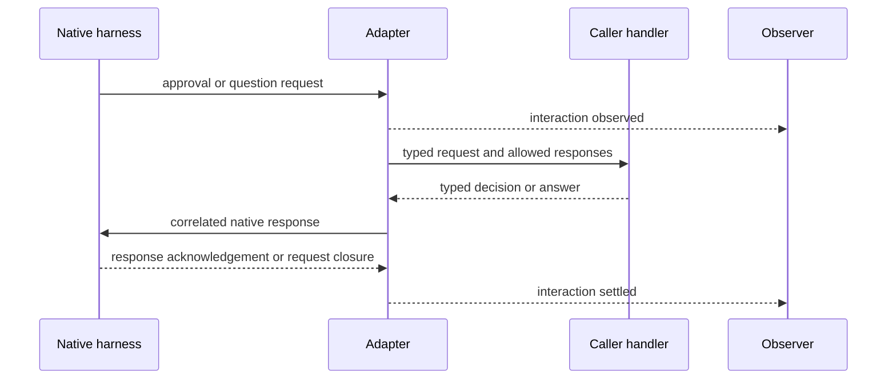

# Observation and Interaction

## Design Position

Events tell the caller what is happening. Typed asynchronous handlers let the caller answer live native requests. The terminal result tells the caller how the logical Run ended. These are separate channels with different authority.

## Events and Result

The shared event vocabulary covers meaningful execution facts: content progress, tool activity, interaction activity, usage observations, and lifecycle changes. Events carry Thread/Run attribution where established and retain native correlation when needed. Backend-specific observations remain explicitly namespaced; they are not forced into misleading common events.

Events are process-local observations, not a replayable durable log. Ordering preserves the adapter's observed order and relevant native causality; it does not invent a total order across independent native producers. Tool completion is not Run completion. Background work without reliable Run attribution does not enter an unrelated active Run's stream.

The result contains the terminal outcome, available final output and usage, and native completion context needed to interpret it. Unknown usage is not zero, and partial output is not a successful final answer. Native stop reasons remain available when a common outcome loses detail.

One consumer drains a Run's stream. Calling `result()` after drainage returns the settled result; calling it while a stream still requires consumption fails explicitly rather than waiting on an undisclosed consumer dependency. `thread.run()` owns drainage for callers who need only the result. [Run cleanup](01-thread-run.md#cancellation-and-cleanup) governs early exit.

## Live Decisions

An approval describes the native action, offered choices, and effective scope. A native choice/scope retains semantics that cannot be faithfully normalized; callers inspect its namespaced native data rather than treating it as a boolean or assuming persistent authority. A question describes the native question and supported answer shape. Handlers cannot expand a decision's authority beyond what the native request and caller policy permit. Unrepresentable native decision semantics produce an explicit unsupported response or Run failure, never automatic approval.

There is one response owner per request. An observational event does not let another consumer answer the same request. A handler response after cancellation or native request closure is stale and is not applied to a later request. Missing handlers, handler exceptions, and disconnection settle or abort the native request explicitly; none imply consent. The default approval behavior is non-approval, not permission escalation.

A live wait is still inside the active Run. It is not a portable suspended state or a durable task that can be answered after restoring history. Applications needing durable human workflows own the surrounding persistence and must use only continuation semantics actually offered by the backend.

## Backpressure and Failure

The native transport reader must remain able to route control replies, cancellation, and interaction requests while event consumers or handlers are slow. An event callback cannot be the sole reader of the transport that its own response depends on.

Buffers are bounded. If observation cannot be retained or delivered, the adapter reports explicit loss or fails the stream; it does not silently discard terminal or interaction facts. A backpressure failure invokes the same cancellation and uncertainty rules as other Run failures. Precise buffer limits are operational choices, not a second execution model.

Applications decide what to persist and expose. Native diagnostics can contain file contents, paths, or tool inputs; they are not automatically safe to publish. Credentials and private provider state are not ordinary event payloads.
