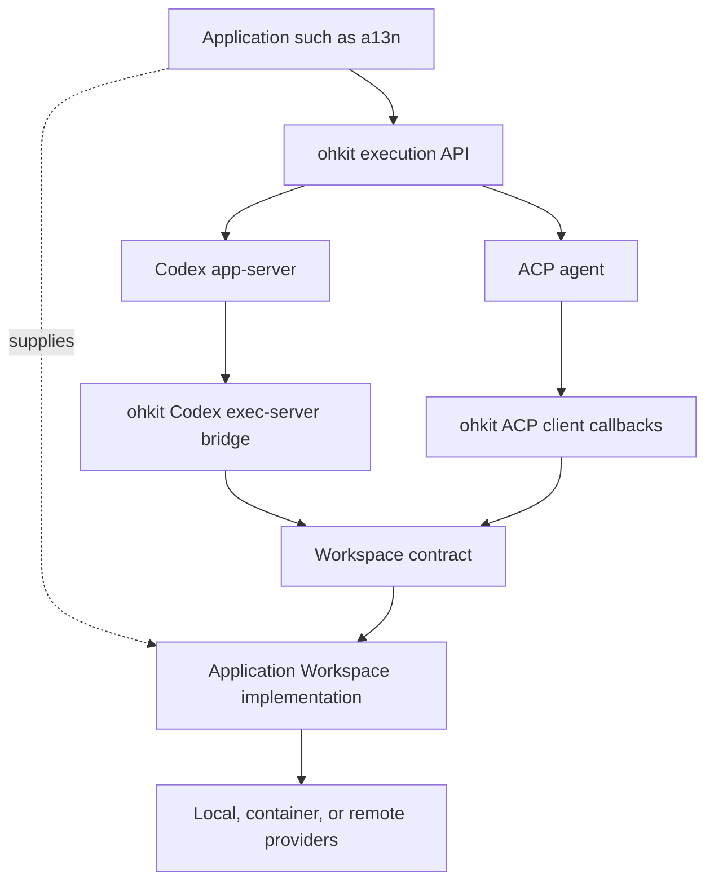

# Workspace Architecture

## Definition

A Workspace supplies file and process operations to a native harness through an ohkit adapter. It describes the execution context actually offered, including the path namespace and supported operation semantics. The caller constructs it; ohkit borrows it.

Workspace is one interface. It can wrap one provider or a downstream aggregate of several providers. ohkit owns no mount table, provider registry, environment provisioning loop, or built-in MultiWorkspace router.

## Architecture and Authority



The control path starts at the application. Work I/O returns through the native bridge to the supplied Workspace. The control client and Workspace host may be separate processes or services. The Codex exec-server protocol belongs to its backend-specific bridge, not the public Workspace interface; ACP uses the same operations through a different protocol. For application-hosted Codex endpoints, the control client holds an endpoint configuration rather than the remote Workspace object.

| Owner                    | Responsibility                                                                                  |
| ------------------------ | ----------------------------------------------------------------------------------------------- |
| Native harness           | Agent loop, tool semantics, native requests, and Turn scheduling                                |
| ohkit bridge             | Protocol translation, native request/handle correlation, and owned resource cleanup             |
| Workspace implementation | Target selection, paths, actual file/process behavior, and enforcement of accepted requirements |
| Caller                   | Provider lifetime, authority, credentials, durable policy, and application-owned bridge hosting |

## Operation Shape

```python
# Conceptual extension seam, not exhaustive signatures or a wire schema.
class Workspace(Protocol):
    @property
    def files(self) -> FileSystem: ...

    async def describe(self) -> WorkspaceInfo: ...

    async def start_process(self, request: ProcessRequest) -> Process: ...
```

Metadata describes the offered execution context, not a catalog of every downstream provider. A composite Workspace must present a coherent namespace and truthful default cwd, platform/shell information, and supported semantics. The bridge does not borrow the orchestrator host's environment or shell metadata to fill missing target facts.

Files use bytes; processes return live typed handles. [Files and processes](01-files-processes.md) owns the meaning of these operations. Wire IDs, JSON-RPC, base64, text slicing, and native output snapshots remain adapter responsibilities.

## Paths and Routing

Paths and cwd belong to the Workspace's exposed namespace. ohkit translates native path representations but does not resolve paths against its own host, rewrite mount prefixes, or choose providers by guessing an operating system from a string.

Location-bearing operations may carry an optional opaque `target` hint. It is a downstream selector, not a durable Workspace identity or authorization token. When absent, selection follows the Workspace implementation's path/cwd/default policy. An adapter cannot invent per-call selectors absent from the native protocol; a caller-selected fixed binding is distinct from native per-call routing.

Relative resolution, overlapping roots, canonicalization, symlink traversal, and cross-target copies belong to the Workspace implementation. A resulting canonical path must be reusable in the exposed namespace. A process handle retains its selected target; later stdin, output, or termination never reroutes it.

A composite namespace does not imply that a command can see every mounted filesystem. The implementation owns shell visibility and rejects combinations it cannot execute coherently. Routing does not grant authority.

## Binding and Lifetime

Workspace is bound to a live native conversation attachment, not just one prompt. The caller keeps it usable for that binding's lifetime. A Run ending does not prove that all native callbacks or process handles have ended.

The caller owns the Workspace and its backing providers. ohkit owns bridge protocol processing and the file/process handles it creates, not a mandatory network listener. Closing the binding stops new requests, settles in-flight callbacks, and closes those handles before releasing the borrowed Workspace. It does not destroy a caller's listener, container, shared Workspace, or unrelated processes.

In an application-hosted service, each executor connection has its own resource scope even when several connections borrow one Workspace. A project URL and a Workspace object are not native session identities. The [Codex hosting contract](../backends/01-codex.md#hosting-and-connection-ownership) owns its connection cleanup and reconnection boundary.

Run cancellation preserves the bridge for native cleanup. Where the protocol has only conversation-scoped resource identity, ohkit must not infer that all handles belong to the cancelled Run. Completed commands may release their handles after exit and output settlement while retaining adapter-owned terminal observations. Explicit native release or binding close settles any remaining owned handles. [Execution cleanup](../execution/01-thread-run.md#cancellation-and-cleanup) governs unresolved effects and cleanup errors.

Where a backend supports Workspace history rebinding, resume can attach a fresh Workspace. It does not restore old process objects, terminal IDs, or open files. No durable Workspace registry is required. The current Codex executor supports new Threads only; its [supported-mode boundary](../backends/01-codex.md#supported-mode-boundary) prohibits pretending that turn-level environment selection covers resume startup I/O.

## a13n Embedding

An a13n adapter implements this interface over its Environment operations and retains downstream multi-environment routing. ohkit has no dependency on a13n or its Environment types.

When a13n Environment instances are scoped to an enclosing a13n Run, the live ohkit binding must fit within that lifetime. A later a13n Run can supply fresh Environment adapters and resume native history only through a backend supporting that rebinding; the current Codex executor does not. This preserves conversation context, not live process continuity. A longer-lived native binding requires the host to supply a correspondingly longer-lived Workspace; ohkit cannot extend a borrowed provider's lifetime.
